# 📈 Financial Time Series Forecasting

<div align="center">

**End-to-end financial time series platform: live data ingestion → feature engineering → ML forecasting → REST API → real-time dashboard.**

[Quick Start](#-quick-start) · [Architecture](#-system-architecture) · [API Docs](#-prediction-api) · [Dashboard](#-real-time-dashboard) · [Models](#-ml-models)

</div>

---

## 🗂️ Table of Contents

- [Overview](#-overview)
- [System Architecture](#-system-architecture)
- [Project Structure](#-project-structure)
- [Model Performance](#-model-performance)
- [ML Models](#-ml-models)
- [Docker Services](#-docker-services)
- [Quick Start](#-quick-start)
- [Prediction API](#-prediction-api)
- [Real-time Dashboard](#-real-time-dashboard)
- [Configuration](#-configuration)
- [Development](#-development)

---

## 🔭 Overview

This project is a **production-grade financial time series system** covering the full ML pipeline:

| Stage | Description | Tech |
|-------|-------------|------|
| **Data Ingestion** | Pull OHLCV candles from Binance, upsert to PostgreSQL | `ccxt`, `APScheduler` |
| **Feature Engineering** | 25+ technical indicators + calendar cyclical features | `pandas`, `numpy` |
| **GBM Forecasting** | XGBoost + LightGBM Stacking + Conformal Prediction Intervals | `xgboost`, `lightgbm`, `optuna` |
| **TFT Forecasting** | Temporal Fusion Transformer, quantile output, Walk-Forward CV | `pytorch-forecasting`, `lightning` |
| **Prediction API** | REST API serving forecasts with 80%/90% confidence intervals | `FastAPI`, `uvicorn` |
| **EDA Dashboard** | Real-time interactive charts + auto-refresh every 30s | `Streamlit`, `Plotly` |

**Supported assets:** `BTC/USDT`, `ETH/USDT` (extensible to any CCXT-compatible symbol)  
**Supported timeframes:** `1d`, `1h` (extensible)

---

## 🏗️ System Architecture

<div align="center">
  
</div>

> 💡 If the diagram above doesn't render, open [`system_architecture.svg`](./system_architecture.svg) directly in your browser for the full animated version.

### Docker Services

| Service | Container | Port | Profile | Description |
|---------|-----------|------|---------|-------------|
| `postgres` | `fin_postgres` | `5432` | core | PostgreSQL 16, persistent `pg_data` volume |
| `scheduler` | `fin_scheduler` | — | core | APScheduler: hourly (1h candles) + daily (1d) |
| `api` | `fin_api` | `8000` | core | FastAPI prediction API, 2 Uvicorn workers |
| `dashboard` | `fin_dashboard` | `8501` | core | Streamlit real-time dashboard |
| `trainer_gbm` | `fin_trainer_gbm` | — | `training` | One-shot GBM training job |
| `trainer_tft` | `fin_trainer_tft` | — | `training` | One-shot TFT training job (GPU/Colab) |
| `pgadmin` | `fin_pgadmin` | `5050` | `tools` | PgAdmin 4 web UI |

All core services share `fin_network` (bridge) and use `.env` for secrets.

---

## 📁 Project Structure

```
Financial Time Series Forecasting & Anomaly Detection/
│
├── 🐳 Docker
│   ├── Dockerfile                   ← Python 3.11-slim base image (CPU torch)
│   ├── docker-compose.yml           ← All services orchestration
│   └── .dockerignore
│
├── 🔌 data_collection_api/          ← Data ingestion pipeline
│   ├── binance_client.py            ← ccxt wrapper, rate-limit safe fetch
│   ├── db_manager.py                ← SQLAlchemy upsert, read, audit log
│   ├── ingestion_pipeline.py        ← initial_load() + incremental_update()
│   ├── scheduler.py                 ← APScheduler: hourly + daily cron jobs
│   ├── config.py                    ← Env-var config (dotenv)
│   └── schema.sql                   ← ohlcv_data, ingestion_log, views
│
├── 🧹 clean_feature_engineering_data/  ← Feature engineering
│   └── features.py                  ← engineer_features(): 25+ indicators
│
├── 🧠 models/                       ← ML models
│   ├── gbm_model.py                 ← GBMForecaster (XGB+LGB+Ridge+Conformal)
│   ├── tft_model.py                 ← TFTForecaster (PyTorch TFT)
│   └── data_loader.py               ← OHLCVDBLoader, export_for_colab()
│
├── ⚡ api/                           ← Prediction REST API
│   ├── main.py                      ← FastAPI app, routes, lifespan
│   ├── schemas.py                   ← Pydantic v2 request/response models
│   ├── model_registry.py            ← Singleton model loader + hot-reload
│   └── predict_service.py           ← Business logic, DB query, forecast
│
├── 📊 dashboard/                    ← Real-time Streamlit dashboard
│   ├── app.py                       ← Main app: 3 tabs, KPI cards, auto-refresh
│   ├── charts.py                    ← 8 Plotly charts (dark TradingView theme)
│   └── data_service.py              ← Cached DB queries, API calls, stats
│
├── 🔍 eda/                          ← Exploratory Data Analysis engine
│   ├── action.py                    ← CLI runner: run_eda()
│   ├── data.py                      ← OHLCVLoader (DB → features)
│   ├── visualized.py                ← EDAVisualizer (matplotlib, dark theme)
│   ├── feature_eda.py               ← FeatureEDA analysis
│   ├── diagnostics.py               ← ADF · KPSS · Hurst · Ljung-Box
│   └── modelling.py                 ← BaselineModels comparison
│
├── 📓 notebooks/                    ← Jupyter notebooks (research)
├── 📜 scripts/                      ← Training entry points
│   ├── run_gbm_local.py             ← Train GBM locally
│   └── run_tft_local.py             ← Train TFT locally
│
├── 🗂️ gbm_output/                   ← GBM results + model artifacts
├── 🗂️ tft_output/                   ← TFT checkpoints + results
├── 📋 reports/figures/              ← EDA charts (PNG)
├── 📝 logs/                         ← Loguru rotating logs
│
├── requirements.txt
├── .env                             ← Secrets (gitignored)
├── .env.example                     ← Template
├── system_architecture.svg          ← Animated system diagram
└── README.md
```

## 📊 Model Performance

> **Evaluation Protocol:** Hold-out test set · BTC/USDT · 1d timeframe · 7-step ahead forecast · Chronological split (no data leakage)

---

### 🏆 Model Comparison

| Model | R² | MAE (USD) | MAPE (%) | RMSE (USD) | Training Time | Status |
|-------|-------|-----------|----------|------------|---------------|--------|
| **TFT v2** | ~0.65–0.75 | ~1,800–3,000 | ~2.5–4.0 | ~2,200–3,500 | ~30 min | ⚡ Improved |
| **GBM Ensemble** | **0.8021** | **1,385** | **2.17** | **1,777** | ~5 min | ✅ Production |
| TFT v1 | -6,623 ❌ | 26,158 ❌ | 13.3 ❌ | 26,166 ❌ | ~15 min | ⚠️ Deprecated |

**Recommendation:**
- **Research/Advanced**: TFT v2 (attention interpretability, quantile native, multivariate ready)
- **Production use**: GBM Ensemble (best accuracy, fast training, stable)
- **With 10k+ rows**: TFT v2 expected to match/exceed GBM

---

### 🔮 TFT v2 (Improved) — Detailed Metrics

> **Major fixes from v1:** HPO Infinity → finite trials | MAPE 13% → <4% | target=close → log_return | Normalizer overflow → EncoderNormalizer

**Expected Performance** (86 samples, BTC/USDT 1d):

| Metric | v1 (deprecated) | v2 (improved) | Target | Status |
|--------|-----------------|---------------|--------|--------|
| **R²** | -6,622.78 ❌ | **~0.65–0.75** ⬆ | > 0.6 | To verify |
| **MAE** | 26,157 USD ❌ | **~1,800–3,000 USD** ⬇ | < 3,000 | To verify |
| **RMSE** | 26,166 USD ❌ | **~2,200–3,500 USD** ⬇ | < 4,000 | To verify |
| **MAPE** | 13.30 % ❌ | **~2.5–4.0 %** ⬇ | < 5% | To verify |
| **sMAPE** | 12.47 % | ~2.5–4.0 % | < 5% | To verify |
| **HPO success** | 0/20 (all Infinity) | **>50% finite** ✅ | >10 | To verify |
| **val_loss** | 6,525 | **~0.001–0.01** ⬇ | < 0.1 | To verify |


### 📈 GBM Stacking Ensemble — Detailed Metrics

**Test Performance** (86 samples, BTC/USDT 1d):

| Metric | Value | Description |
|--------|-------|-------------|
| **R²** | **0.8021** | 80% variance explained |
| **MAE** | 1,385.37 USD | Mean absolute error |
| **RMSE** | 1,776.98 USD | Root mean squared error |
| **MSE** | 3,157,646 USD² | Mean squared error |
| **MAPE** | 2.17 % | Mean absolute percentage error |
| **sMAPE** | 2.14 % | Symmetric MAPE |

**Prediction Intervals:**

| Interval | Winkler Score | Coverage | Target |
|----------|---------------|----------|--------|
| 80% CI (q10–q90) | 6,481.68 | 63.95 % | 80% |
| 90% CI (q05–q95) | 9,249.51 | 68.60 % | 90% |

**Out-of-Fold Cross-Validation** (5-fold TimeSeriesSplit):

| Fold | XGBoost RMSE | LightGBM RMSE |
|------|--------------|---------------|
| 1 | 4,590 | 3,849 |
| 2 | 5,647 | 7,819 |
| 3 | 7,879 | 8,737 |
| 4 | 2,926 | 4,108 |
| 5 | 2,202 | 2,401 |
| **Mean** | **4,649** | **5,383** |

---

### 🎯 When to Use Which Model

| Scenario | Recommended Model | Reason |
|----------|-------------------|--------|
| **Research/Experimentation** | TFT v2 | Attention mechanism, native multi-step |
| **Production deployment** | GBM Ensemble | Best accuracy, fast inference, stable |
| **Small dataset (<1k rows)** | GBM Ensemble | Tree-based models need less data |
| **Large dataset (>10k rows)** | TFT v2 | Deep learning shines with more data |
| **Multi-step forecast (1–7 days)** | Both | GBM recursive, TFT native multi-step |
| **Uncertainty quantification** | TFT v2 or GBM Conformal | Both provide prediction intervals |
| **Interpretability** | TFT v2 (attention) or GBM (SHAP) | TFT: variable importance, GBM: tree SHAP |
| **Multiple assets** | TFT v2 | Native multivariate support |
| **Quick prototyping** | GBM Ensemble | 5 min training vs 30 min |
| **GPU available** | TFT v2 | 10x faster training with GPU |
| **CPU only** | GBM Ensemble | Optimized for CPU |

---


### GBM Stacking Ensemble (`models/gbm_model.py`)

A multi-stage ensemble with **4 accuracy-boosting techniques**:

#### ① Auto Lag-Feature Engineering
Automatically creates lag features, rolling statistics and EWMA from the target:
```
lags          : [1, 2, 3, 5, 7, 14, 21]
rolling_windows: [7, 14, 30]
ewma_spans    : [7, 14]
```
Plus 25+ external features: RSI, MACD, Bollinger, ATR, volume ratio, calendar cyclicals.

#### ② Optuna + MedianPruner HPO
Bayesian hyperparameter optimisation for both XGBoost and LightGBM:
- **30 trials** per model
- **MedianPruner** for early trial termination
- Inner 3-fold time-series CV per trial

#### ③ OOF Stacking Ensemble
Out-of-fold stacking with Ridge meta-learner:
- **5-fold** outer CV
- XGBoost + LightGBM as base models
- Ridge/Lasso/ElasticNet as configurable meta-learner

#### ④ Conformal Prediction Intervals
Non-parametric intervals with **coverage guarantee**:
- Calibrated on held-out set (15% of train)
- Returns `lower_80 / upper_80` and `lower_90 / upper_90`
- Winkler Score & Coverage metrics in evaluation

### TFT Forecaster (`models/tft_model.py`)

**Temporal Fusion Transformer** with quantile output:

| Technique | Detail |
|-----------|--------|
| **Quantile Forecasting** | q10 / q25 / q50 / q75 / q90 |
| **Walk-Forward CV** | Time-aware, no data leakage |
| **Optuna HPO** | hidden_size, lr, dropout, attention_heads |
| **Checkpoint Ensemble** | Average top-k best checkpoints |
| **Attention Interpretability** | Variable importance weights |

```python
from models.tft_model import TFTConfig, TFTForecaster

cfg = TFTConfig(target="close", max_encoder_length=60, max_prediction_length=7)
f   = TFTForecaster(cfg)
df_train, df_val, df_test = f.load_and_split("train.json", "test.json")
f.tune_hyperparameters(df_train, df_val)   # optional Optuna HPO
f.train(df_train, df_val)
preds = f.ensemble_predict(df_test)
```

> **Note:** TFT is GPU-heavy. Train on Google Colab, then download the checkpoint.

---

## 🐳 Docker Services

### Prerequisites

- Docker Desktop ≥ 24 with Compose v2
- `.env` file configured (see [Configuration](#-configuration))

### Core services (always on)

```bash
# Start postgres + scheduler + api + dashboard
docker compose up -d

# View logs
docker compose logs -f scheduler
docker compose logs -f api
docker compose logs -f dashboard

# Stop everything
docker compose down
```

### Training (on-demand)

```bash
# Train GBM model (runs once, saves to gbm_output/)
docker compose --profile training run --rm trainer_gbm

# After training — hot-reload model into API (no restart needed!)
curl -X POST "http://localhost:8000/models/reload?model=gbm"

# Train TFT locally (or use Colab for GPU)
docker compose --profile training run --rm trainer_tft
```

### Optional tools

```bash
# PgAdmin web UI at http://localhost:5050
docker compose --profile tools up -d pgadmin
# Login: admin@local.dev / admin
```

---

## 🚀 Quick Start

### 1. Clone & configure

```bash
git clone <repo-url>
cd "Financial Time Series Forecasting & Anomaly Detection"
cp .env.example .env
# Edit .env: fill in BINANCE_API_KEY
```

### 2. Start all services

```bash
docker compose up -d
```

### 3. Initial data load

```bash
# Run initial historical ingestion (2022-01-01 → now)
docker compose exec scheduler python -m data_collection_api.run_ingestion --mode initial
```

### 4. Train GBM model

```bash
docker compose --profile training run --rm trainer_gbm
```

### 5. Reload model into API

```bash
curl -X POST "http://localhost:8000/models/reload?model=gbm"
```

### 6. Open dashboard

```
http://localhost:8501          → Streamlit Dashboard (EDA + Forecast)
http://localhost:8000/docs     → FastAPI Swagger UI
```

---

## ⚡ Prediction API

Base URL: `http://localhost:8000`

### `GET /health`
```json
{
  "status": "ok",
  "models_loaded": {"GBM": true, "TFT": false},
  "db_connected": true,
  "version": "1.0.0"
}
```

### `POST /predict/gbm`

**From database (default):**
```bash
curl -X POST http://localhost:8000/predict/gbm \
  -H "Content-Type: application/json" \
  -d '{
    "symbol": "BTC/USDT",
    "timeframe": "1d",
    "steps": 7,
    "from_db": true,
    "n_history": 100
  }'
```

**From raw candles:**
```bash
curl -X POST http://localhost:8000/predict/gbm \
  -H "Content-Type: application/json" \
  -d '{
    "symbol": "BTC/USDT",
    "timeframe": "1d",
    "steps": 3,
    "from_db": false,
    "candles": [
      {"open_time": "2024-01-01T00:00:00Z", "open": 42000, "high": 43000,
       "low": 41500, "close": 42800, "volume": 1234.5},
      ...
    ]
  }'
```

**Response:**
```json
{
  "symbol": "BTC/USDT",
  "timeframe": "1d",
  "model": "GBM",
  "steps": 7,
  "n_history_rows": 100,
  "generated_at": "2024-01-08T10:30:00Z",
  "forecast": [
    {
      "step": 1,
      "y_pred": 43500.25,
      "lower_80": 41200.00, "upper_80": 45800.00,
      "lower_90": 40100.00, "upper_90": 46900.00
    }
  ]
}
```

### `POST /models/reload` — Hot-swap model (no restart)
```bash
curl -X POST "http://localhost:8000/models/reload?model=gbm"
```

### `GET /data/latest` — Latest candles from DB
```bash
curl "http://localhost:8000/data/latest?symbol=BTC%2FUSDT&timeframe=1d&n=20"
```

Full interactive docs: **[http://localhost:8000/docs](http://localhost:8000/docs)**

---

## 📊 Real-time Dashboard

URL: **[http://localhost:8501](http://localhost:8501)**

| Tab | Charts |
|-----|--------|
| **📊 EDA Live** | Candlestick + MA7/MA25 + Bollinger Bands, Volume bars (colored), RSI(14) with zones, MACD histogram + signal |
| **🔮 Prediction** | GBM multi-step forecast line, Conformal Interval shading (80%/90%), per-step forecast table with Δ% |
| **📈 Diagnostics** | Log return distribution + Normal KDE, Drawdown curve, Price Z-score, ADF test, KPSS test, Hurst exponent |

**Features:**
- 🔄 **Auto-refresh** every 30 seconds (toggle in sidebar)
- ⚡ **`@st.cache_data(ttl=30)`** — DB queries cached 30s to reduce load
- 📐 **Symbol / Timeframe / History rows** — configurable in sidebar
- 🔮 **Forecast steps 1–30** — slider in sidebar
- 🌙 **Dark theme** — TradingView-style Plotly charts

---

## ⚙️ Configuration

Copy `.env.example` → `.env` and fill in:

```env
# Binance API (required for data ingestion)
BINANCE_API_KEY=your_key_here
BINANCE_SECRET_KEY=your_secret_here

# PostgreSQL
DB_HOST=localhost          # use 'postgres' inside Docker network
DB_PORT=5432
DB_NAME=financial_ts
DB_USER=postgres
DB_PASSWORD=your_password

# Ingestion settings
SYMBOLS=BTC/USDT,ETH/USDT
TIMEFRAMES=1d,1h
START_DATE=2022-01-01
BATCH_LIMIT=1000

# API (optional overrides)
GBM_MODEL_PATH=gbm_output/gbm_forecaster.joblib
TFT_MODEL_PATH=tft_output/tft_forecaster.joblib
```

---

## 🛠️ Development

### Install locally (without Docker)

```bash
python -m venv .venv
.venv\Scripts\activate          # Windows
pip install -r requirements.txt

# Run API locally
uvicorn api.main:app --reload --port 8000

# Run Dashboard locally
streamlit run dashboard/app.py

# Run Scheduler locally
python -m data_collection_api.scheduler

# Run EDA
python -m eda.action
```

### Run tests

```bash
pytest tests/ -v
```

### Build Docker image

```bash
docker compose build
```

### Database schema

```bash
# Apply schema manually (auto-applied on first docker compose up)
psql -U postgres -d financial_ts -f data_collection_api/schema.sql
```

### Export data for Colab (TFT training)

```bash
python scripts/export_for_colab.py
# Outputs: colab_data/train.json, colab_data/test.json, colab_data/metadata.json
```

---

## 📦 Tech Stack

| Category | Libraries |
|----------|-----------|
| **Data** | `ccxt 4.3+`, `psycopg2`, `SQLAlchemy 2.0`, `APScheduler 3.10+` |
| **Feature Eng.** | `pandas 2.0+`, `numpy 1.24+`, `scikit-learn 1.3+` |
| **GBM** | `xgboost`, `lightgbm`, `optuna 3.0+`, `joblib 1.3+` |
| **TFT** | `torch 2.0+`, `pytorch-lightning 2.0+`, `pytorch-forecasting 1.0+` |
| **API** | `fastapi 0.111+`, `uvicorn`, `pydantic v2`, `httpx 0.27+` |
| **Dashboard** | `streamlit 1.35+`, `plotly 5.0+`, `statsmodels 0.14+` |
| **Infra** | `Docker Compose`, `PostgreSQL 16-alpine`, `Python 3.11-slim`, `loguru` |

---

## 📄 License

MIT © 2026

---
