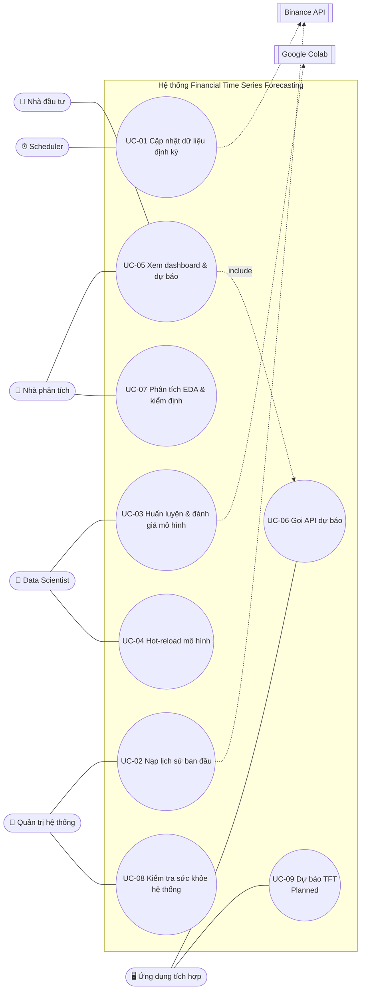

# Use Case — Financial Time Series Forecasting

## 1. Sơ đồ Use Case

## 2. Đặc tả Use Case

### UC-06 — Gọi API dự báo
| Mục | Nội dung |
|-----|----------|
| Actor chính | Ứng dụng tích hợp (gián tiếp: Dashboard) |
| Mục tiêu | Nhận dự báo giá đóng cửa N bước kèm khoảng tin cậy 80% / 90% |
| Tiền điều kiện | Mô hình GBM đã nạp; nếu `from_db = true` thì CSDL có dữ liệu cho symbol × timeframe |
| Hậu điều kiện (thành công) | Client nhận danh sách dự báo theo bước, thời điểm tạo (UTC) và số nến đã dùng |
| Quy tắc | BR-08, BR-11 |

**Luồng chính**
1. Client gửi `POST /predict/gbm` với `symbol`, `timeframe`, `steps`, `from_db = true`, `n_history`.
2. Hệ thống kiểm tra tham số (BR-08).
3. Hệ thống kiểm tra mô hình GBM đã nạp.
4. Hệ thống truy vấn `n_history` nến gần nhất từ `ohlcv_data`, sắp xếp tăng dần theo thời gian.
5. Hệ thống tính đặc trưng kỹ thuật còn thiếu và tạo lag / rolling / EWMA.
6. Hệ thống dự báo đệ quy từng bước t+1 … t+N, mỗi bước kèm khoảng conformal 80% / 90%.
7. Hệ thống trả `200` với `PredictResponse`.

**Luồng thay thế / ngoại lệ**
- **1a.** `from_db = false` → client gửi kèm danh sách `candles` (≥ 10 nến); bỏ qua bước 4.
- **2a.** Tham số ngoài giới hạn hoặc thiếu `candles` → `422`.
- **3a.** Mô hình chưa nạp → `503` "GBM model chưa được load…".
- **4a.** CSDL không truy vấn được → `503`.
- **4b.** Ít hơn 10 nến khả dụng → lỗi "Cần ít nhất 10 candles"; hiện endpoint trả `500` thay vì `422` (xem G-06).
- **6a.** Lỗi không lường trước → `500` kèm thông báo lỗi nội bộ.

### UC-05 — Xem dashboard & dự báo
| Mục | Nội dung |
|-----|----------|
| Actor chính | Nhà đầu tư, Nhà phân tích |
| Mục tiêu | Nắm nhanh tình hình giá, chỉ báo và dự báo trên một màn hình |
| Tiền điều kiện | Scheduler đã thu thập dữ liệu; API đang chạy (để có dự báo) |
| Quy tắc | BR-11, BR-13 |

**Luồng chính**
1. Người dùng mở dashboard.
2. Người dùng chọn symbol, timeframe, số nến lịch sử, số bước dự báo trên sidebar.
3. Hệ thống tải dữ liệu từ PostgreSQL (cache 30 giây) và tính chỉ báo.
4. Hệ thống hiển thị 6 thẻ KPI.
5. Tab **EDA Live**: biểu đồ nến, khối lượng, RSI, MACD, thống kê mô tả.
6. Tab **Prediction**: hệ thống gọi UC-06, hiển thị đường dự báo, vùng khoảng tin cậy và bảng dự báo từng bước.
7. Tab **Diagnostics**: phân phối log return, drawdown, Z-score, ADF / KPSS / Hurst.
8. Nếu bật auto-refresh, hệ thống tự tải lại theo chu kỳ đã chọn (10–300 giây).

**Luồng thay thế / ngoại lệ**
- **3a.** Không có dữ liệu → hiển thị "No data found. Make sure the scheduler has ingested data into the DB." và dừng.
- **6a.** API không kết nối được / mô hình chưa nạp → cảnh báo kèm hướng dẫn huấn luyện và reload; các tab khác vẫn hoạt động.
- **8a.** Người dùng bấm **Refresh now** → xóa cache và tải lại ngay.

### UC-01 — Cập nhật dữ liệu định kỳ
| Mục | Nội dung |
|-----|----------|
| Actor chính | Scheduler (thời gian) |
| Hệ thống liên quan | Binance API |
| Mục tiêu | Dữ liệu trong CSDL luôn có nến mới nhất đã đóng |
| Quy tắc | BR-01 – BR-07 |

**Luồng chính**
1. Đến lịch (phút 02 mỗi giờ cho `1h`; 00:05 UTC cho `1d`), scheduler kích hoạt job.
2. Với mỗi symbol: hệ thống lấy thời điểm nến mới nhất trong CSDL.
3. Hệ thống ghi `ingestion_log` trạng thái `running`.
4. Hệ thống gọi Binance lấy các nến từ thời điểm đó + 1 giây.
5. Hệ thống làm sạch dữ liệu (BR-04).
6. Hệ thống upsert vào `ohlcv_data`, đếm số dòng thêm mới / cập nhật.
7. Hệ thống cập nhật `ingestion_log` trạng thái `success` kèm số dòng.

**Luồng thay thế / ngoại lệ**
- **2a.** Chưa có dữ liệu → nạp từ `START_DATE`, chế độ `initial`.
- **4a.** Rate limit / lỗi mạng → thử lại với thời gian chờ tăng dần; vượt số lần thử → bước 4b.
- **4b.** Lỗi không khắc phục được → `ingestion_log` trạng thái `error` kèm thông báo lỗi.
- **1a.** Lần chạy trước chưa kết thúc → không chạy song song; lần lỡ được gộp (BR-07).

### UC-02 — Nạp lịch sử ban đầu
1. Quản trị viên chạy `python -m data_collection_api.run_ingestion --mode initial` (hoặc qua `docker compose exec scheduler …`).
2. Với mỗi cặp symbol × timeframe, hệ thống thực hiện bước 3–7 của UC-01 với mốc bắt đầu `START_DATE`.
3. Hệ thống in bảng tóm tắt số nến, thời điểm sớm nhất / muộn nhất (view `v_data_summary`).
- **2a.** Chạy lại nhiều lần vẫn an toàn nhờ upsert (BR-01).

### UC-03 — Huấn luyện & đánh giá mô hình
| Mục | Nội dung |
|-----|----------|
| Actor chính | Data Scientist |
| Mục tiêu | Tạo mô hình GBM mới kèm kết quả đánh giá |

1. Data Scientist chạy `docker compose --profile training run --rm trainer_gbm` (hoặc `scripts/run_gbm_local.py`).
2. Hệ thống đọc dữ liệu, tạo đặc trưng, tách train / calibration / test theo thời gian (BR-09).
3. Hệ thống tối ưu siêu tham số XGBoost, LightGBM bằng Optuna.
4. Hệ thống huấn luyện stacking OOF 5-fold với meta-learner Ridge.
5. Hệ thống hiệu chỉnh khoảng conformal trên tập calibration.
6. Hệ thống đánh giá trên tập test và lưu `gbm_results.json`, `feature_importance.json`, `hpo_results.json`, `forecast_plot.html`, `gbm_forecaster.joblib`.
- **1a.** Mô hình TFT: xuất dữ liệu bằng `scripts/export_for_colab.py`, huấn luyện trên Colab bằng `notebooks/tft_colab.ipynb`, tải kết quả về `tft_output/`.
- **6a.** *(Planned)* Kiểm tra cổng chất lượng (MAPE, coverage) trước khi cho phép reload — xem US-12.

### UC-04 — Hot-reload mô hình
1. Data Scientist gọi `POST /models/reload?model=gbm|tft|all` (tùy chọn `path`).
2. Hệ thống khóa (lock) việc nạp, đọc file mô hình.
3. Hệ thống thay mô hình đang phục vụ và trả `{"reloaded": {...}, "timestamp": ...}`.
- **2a.** File không tồn tại → trả `"failed (file not found)"`, giữ nguyên mô hình hiện tại.
- **2b.** File lỗi khi đọc → mô hình tương ứng chuyển về chưa nạp, ghi log lỗi.

### UC-07 — Phân tích EDA & kiểm định
1. Nhà phân tích chạy `python -m eda.action`.
2. Hệ thống đọc dữ liệu từ CSDL, tính đặc trưng.
3. Hệ thống xuất biểu đồ PNG vào `reports/figures/<SYMBOL>_<TF>/` và `diagnostics_report.txt` (thống kê mô tả, VaR / CVaR, ADF, KPSS, Ljung-Box, Jarque-Bera, Hurst).
4. Nhà phân tích dùng kết quả để chọn cách mô hình hóa (ví dụ: giá không dừng → dự báo dựa trên lag / log return).

### UC-08 — Kiểm tra sức khỏe hệ thống
1. Quản trị viên (hoặc công cụ giám sát) gọi `GET /health`.
2. Hệ thống kiểm tra kết nối CSDL và trạng thái từng mô hình.
3. Hệ thống trả `ok` / `degraded` / `error` theo BR-10.
- **3a.** Cần chi tiết → gọi `GET /models/status`.

### UC-09 — Dự báo TFT *(Planned)*
1. Client gọi `POST /predict/tft` với cùng request như UC-06.
2. Hệ thống dự báo bằng TFT và trả `PredictResponse` với `model = "TFT"`.
- **Hiện trạng:** endpoint bị khai báo trùng và handler đang hoạt động trả kết quả GBM (G-03); service TFT chưa triển khai (G-07).
