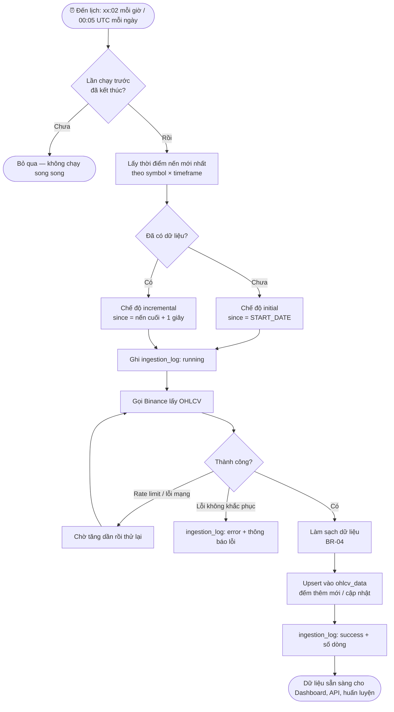
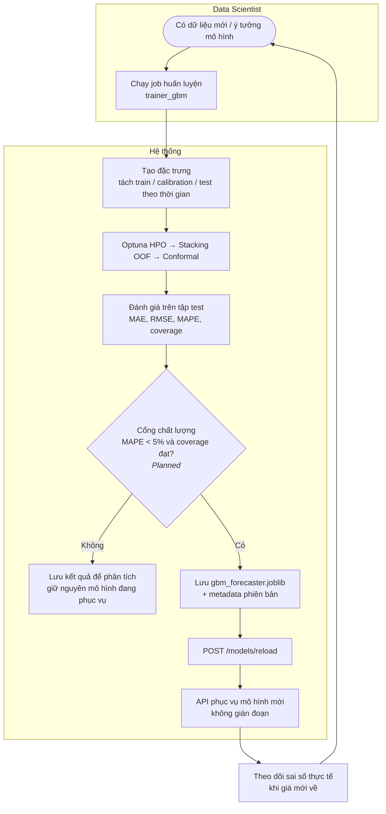
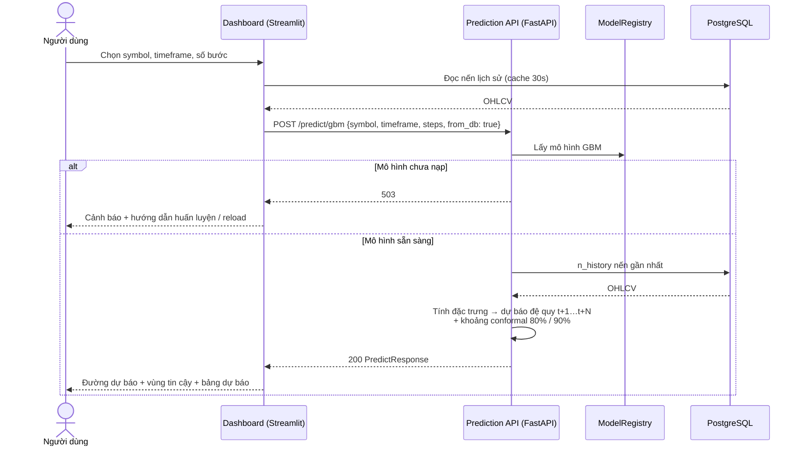
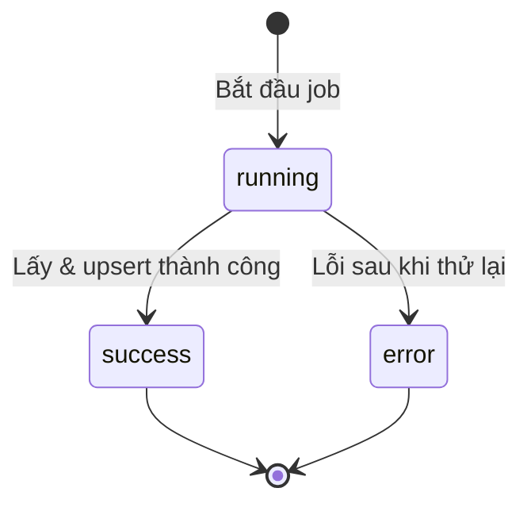
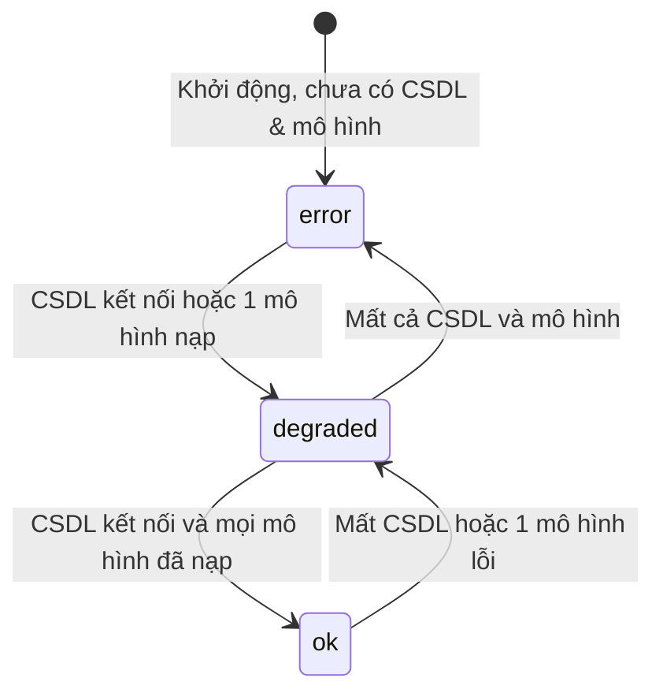

# Quy trình nghiệp vụ — Financial Time Series Forecasting

## 1. Quy trình thu thập dữ liệu thị trường

### 1.1 As-is (khi chưa có hệ thống)
- Nhà phân tích tải file CSV giá từ sàn hoặc website thủ công, mỗi lần một symbol / khung thời gian.
- Dữ liệu dễ **thiếu nến, trùng nến**, lệch múi giờ; không biết lần tải gần nhất là khi nào.
- Mỗi lần phân tích phải tự tính lại chỉ báo kỹ thuật.

### 1.2 To-be (với hệ thống)

**Giá trị mang lại:** dữ liệu luôn cập nhật ngay sau khi nến đóng, không trùng lặp, cùng múi giờ UTC, mỗi lần chạy đều có nhật ký để kiểm toán.

## 2. Vòng đời mô hình (Model lifecycle)

### 2.1 As-is (hiện trạng)
Data Scientist huấn luyện → kiểm tra kết quả bằng mắt → gọi reload thủ công. Không có bước kiểm tra chỉ số bắt buộc, nên mô hình kém hơn vẫn có thể được đưa vào sử dụng (xem G-01 trong SRS).

### 2.2 To-be (đề xuất — bổ sung cổng chất lượng)

## 3. Luồng xử lý một yêu cầu dự báo

## 4. Sơ đồ trạng thái

### 4.1 Trạng thái một lần thu thập dữ liệu (`ingestion_log.status`)

| Trạng thái | Ý nghĩa | Hành động của quản trị viên |
|-----------|---------|----------------------------|
| running | Đang chạy | — (nếu kéo dài bất thường: kiểm tra log scheduler) |
| success | Hoàn tất, có `rows_inserted` / `rows_updated` | — |
| error | Thất bại, có `error_message` | Kiểm tra khóa API, kết nối mạng, giới hạn tần suất; chạy lại `--mode update` |

### 4.2 Trạng thái sức khỏe API (`/health`)

## 5. Lịch vận hành

| Thời điểm (UTC) | Job | Dữ liệu | Ghi chú |
|-----------------|-----|---------|---------|
| Khi khởi động scheduler | Cập nhật tăng dần | Mọi timeframe cấu hình | Đảm bảo dữ liệu mới ngay |
| Phút 02 mỗi giờ | `hourly_ohlcv` | Nến `1h` | Ân hạn 5 phút |
| 00:05 hằng ngày | `daily_ohlcv` | Nến `1d` | Ân hạn 10 phút |
| Theo nhu cầu | `trainer_gbm` / `trainer_tft` | Mô hình | Profile `training` |

## 6. Hành trình người dùng (User Journey) — nhà đầu tư mỗi sáng

| Bước | Người dùng làm gì | Màn hình / thành phần hỗ trợ |
|------|-------------------|-----------------------------|
| 1 | Xem giá BTC hiện tại, % thay đổi, RSI có quá mua / quá bán không | Hàng thẻ KPI |
| 2 | Xem xu hướng, Bollinger, khối lượng của 200 phiên gần nhất | Tab EDA Live |
| 3 | Xem dự báo 7 ngày tới và khoảng giá 80% / 90% | Tab Prediction |
| 4 | Đánh giá rủi ro: drawdown hiện tại, phân phối lợi nhuận có đuôi dày không | Tab Diagnostics |
| 5 | *(Planned)* Nhận cảnh báo khi giá biến động bất thường | Kênh thông báo |
