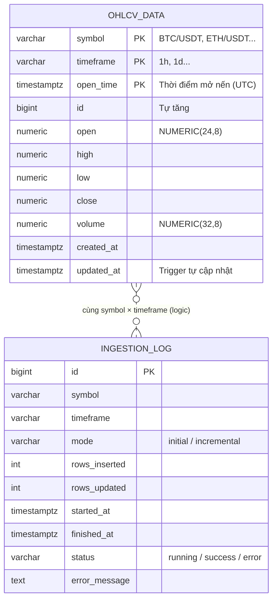

# Mô hình dữ liệu (ERD) & Data Contract — Financial Time Series Forecasting

Hệ thống dùng một CSDL PostgreSQL `financial_ts` (schema tại `data_collection_api/schema.sql`, tự áp dụng khi container `postgres` khởi tạo lần đầu). Mô hình huấn luyện và kết quả đánh giá được lưu dưới dạng file trong `gbm_output/`, `tft_output/`.

## 1. ERD — Dữ liệu thị trường

Một bảng chung `ohlcv_data` lưu nến của **mọi** symbol × timeframe, nên thêm tài sản / khung thời gian mới chỉ cần đổi cấu hình, không đổi cấu trúc bảng. `ingestion_log` liên kết **logic** với `ohlcv_data` qua cặp (symbol, timeframe) — không dùng khóa ngoại.

### 1.1 Từ điển dữ liệu — `ohlcv_data`
| Cột | Kiểu | Bắt buộc | Mô tả | Quy tắc |
|-----|------|----------|-------|---------|
| symbol | VARCHAR(20) | ✔ | Cặp tài sản | Thuộc `SYMBOLS` cấu hình |
| timeframe | VARCHAR(5) | ✔ | Khung thời gian | Thuộc `TIMEFRAMES` cấu hình |
| open_time | TIMESTAMPTZ | ✔ | Thời điểm mở nến | UTC; khóa chính cùng symbol, timeframe (BR-01, BR-02) |
| open / high / low / close | NUMERIC(24,8) | ✔ | Giá mở / cao / thấp / đóng | > 0; high ≥ max(open, close, low); low ≤ min(open, close, high) (BR-04) |
| volume | NUMERIC(32,8) | ✔ | Khối lượng giao dịch | ≥ 0 |
| created_at | TIMESTAMPTZ | ✔ | Thời điểm ghi lần đầu | Mặc định `NOW()` |
| updated_at | TIMESTAMPTZ | ✔ | Thời điểm cập nhật gần nhất | Trigger `set_updated_at` |

**Index:** `idx_ohlcv_symbol_tf_time (symbol, timeframe, open_time DESC)` cho truy vấn nến mới nhất; `idx_ohlcv_open_time (open_time DESC)` cho truy vấn theo khoảng thời gian.

### 1.2 Từ điển dữ liệu — `ingestion_log`
| Cột | Kiểu | Mô tả |
|-----|------|-------|
| id | BIGSERIAL | Mã lần chạy |
| symbol, timeframe | VARCHAR | Cặp dữ liệu được thu thập |
| mode | VARCHAR(20) | `initial` hoặc `incremental` |
| rows_inserted / rows_updated | INTEGER | Số nến thêm mới / cập nhật |
| started_at / finished_at | TIMESTAMPTZ | Thời điểm bắt đầu / kết thúc |
| status | VARCHAR(20) | `running` → `success` / `error` |
| error_message | TEXT | Thông báo lỗi (nếu có) |

### 1.3 View phục vụ báo cáo
| View | Nội dung | Sử dụng |
|------|----------|---------|
| `v_latest_price` | Nến mới nhất của mỗi symbol × timeframe | Hiển thị giá hiện tại |
| `v_data_summary` | Tổng số nến, thời điểm sớm nhất / muộn nhất, lần cập nhật cuối theo symbol × timeframe | Kiểm tra độ đầy đủ & độ mới của dữ liệu; đề xuất làm nguồn danh sách lựa chọn trên dashboard (G-04) |

## 2. Danh mục đặc trưng (Feature catalog)

Đặc trưng được tính từ OHLCV (`clean_feature_engineering_data/features.py`, `models/gbm_model.py`), **không lưu vào CSDL** mà tính lại khi phân tích / dự báo.

| Nhóm | Đặc trưng | Ý nghĩa nghiệp vụ |
|------|-----------|-------------------|
| Lợi nhuận | `return_pct`, `log_return` | Mức tăng / giảm giữa hai nến |
| Xu hướng | `ma_7`, `ma_25`, `ma_99`, `ema_12`, `ema_26` | Xu hướng ngắn / trung / dài hạn |
| Động lượng | `macd`, `macd_signal`, `macd_hist`, `rsi_14` | Sức mạnh xu hướng, vùng quá mua (> 70) / quá bán (< 30) |
| Biến động | `bb_mid`, `bb_upper`, `bb_lower`, `bb_width`, `bb_pct`, `atr_14`, `rolling_vol_30` | Độ rộng dao động giá, mức rủi ro |
| Khối lượng | `volume_ma_20`, `volume_ratio` | Khối lượng bất thường so với trung bình 20 phiên |
| Rủi ro / bất thường | `price_zscore` (cửa sổ 60), `drawdown_pct` | Độ lệch so với trung bình, mức sụt giảm từ đỉnh |
| Chế độ thị trường | `regime` (Bull / Bear / Sideways theo MA7–MA25–MA99), `vol_regime` (Low / Mid / High theo ATR) | Phân loại bối cảnh thị trường |
| Lịch (cyclical) | `hour_*`, `dow_*`, `month_*`, `doy_*` (sin / cos) | Tính mùa vụ theo giờ, thứ, tháng, ngày trong năm |
| Lag (chỉ GBM) | `close_lag_{1,2,3,5,7,14,21}`, `close_roll_{mean,min,max…}_{7,14,30}`, `close_ewma_{7,14}` | Giá quá khứ và thống kê trượt làm đầu vào dự báo |

## 3. Hợp đồng dữ liệu API (Data Contract)

### 3.1 `PredictRequest` — `POST /predict/gbm`
| Trường | Kiểu | Mặc định | Ràng buộc |
|--------|------|----------|-----------|
| symbol | string | `BTC/USDT` | — |
| timeframe | string | `1d` | — |
| steps | int | 7 | 1 – 30 |
| from_db | bool | true | Nếu false phải gửi `candles` |
| n_history | int | 100 | 30 – 1000 |
| candles | list<OHLCVRecord> | null | ≥ 10 nến khi `from_db = false` (xem G-06) |

### 3.2 `PredictResponse`
| Trường | Kiểu | Mô tả |
|--------|------|-------|
| symbol, timeframe | string | Lặp lại từ request |
| model | `GBM` \| `TFT` | Mô hình đã dùng |
| steps | int | Số bước dự báo |
| forecast[] | list<ForecastStep> | `step`, `y_pred`, `lower_80`, `upper_80`, `lower_90`, `upper_90` |
| n_history_rows | int | Số nến thực sự dùng để dự báo |
| generated_at | datetime (UTC) | Thời điểm tạo dự báo |

### 3.3 Mã phản hồi
| Mã | Khi nào |
|----|---------|
| 200 | Dự báo thành công |
| 422 | Tham số không hợp lệ / dữ liệu không đủ |
| 501 | Chức năng chưa triển khai (TFT service) |
| 503 | Mô hình chưa nạp hoặc CSDL không khả dụng |
| 500 | Lỗi nội bộ |

## 4. Artifact mô hình

| File | Nội dung | Người dùng |
|------|----------|-----------|
| `gbm_output/gbm_forecaster.joblib` | Mô hình GBM đã huấn luyện (được API nạp qua `GBM_MODEL_PATH`) | API |
| `gbm_output/gbm_results.json` | Cấu hình, siêu tham số tốt nhất, OOF RMSE từng fold, ngưỡng conformal, chỉ số test | Data Scientist, báo cáo KPI |
| `gbm_output/feature_importance.json` | Mức độ quan trọng của đặc trưng (XGBoost, LightGBM) | Nhà phân tích — giải thích mô hình |
| `gbm_output/hpo_results.json` | Lịch sử các trial Optuna | Data Scientist |
| `gbm_output/forecast_plot.html` | Biểu đồ dự báo so với thực tế trên tập test | Báo cáo |
| `tft_output/*` | Kết quả mô hình nghiên cứu TFT | Data Scientist |
| `colab_data/{train,test,metadata}.json` | Dữ liệu xuất cho Colab (BTC/USDT 1d, 710 nến, test 15%) | Huấn luyện TFT |

## 5. Quy tắc chất lượng dữ liệu

| Vấn đề | Cách phát hiện | Cách xử lý | Chỉ số theo dõi |
|--------|----------------|-----------|-----------------|
| Thiếu giá trị bắt buộc | `NULL` ở cột OHLCV / open_time | Loại bản ghi | `dropped_nulls` |
| Nến trùng thời điểm | Trùng `open_time` trong một lần lấy | Giữ một bản | `dropped_duplicates` |
| Giá trị vô hạn | `±inf` | Loại bản ghi | `dropped_inf` |
| Giá ≤ 0 / khối lượng âm | So sánh ngưỡng | Loại bản ghi | `dropped_non_positive` |
| Nến OHLC mâu thuẫn | high < low, high < open/close… | Loại bản ghi | `dropped_invalid_ohlc` |
| Nạp trùng giữa các lần chạy | Khóa chính (symbol, timeframe, open_time) | Upsert — cập nhật giá trị | `rows_updated` |
| Thiếu nến trong chuỗi | Khoảng cách giữa hai nến > 1 timeframe | Đếm số khoảng trống (gap) khi làm sạch | Số gap |
| Lệch múi giờ | — | Chuẩn hóa `open_time` về UTC | — |
